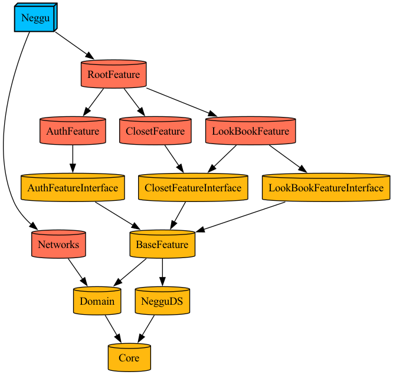

## 네꾸 - 네가 꾸미는 옷장
> `2025.02 ~ Now` [앱스토어 바로가기]()

  

네꾸는 디지털 옷장 및 코디 아카이빙 서비스 입니다.   
옷을 디지털 옷장에 저장할 수 있고, 옷장의 옷들로 코디를 생성할 수 있습니다.   
소중한 네꾸들을 수집해보세요!  

 

  

> 🙏 현재는 디지털 옷장과 코디 생성 기능을 제공하고 있으며, V2에서 꾸며주기 및 정보 세분화, 취향분석 컨텐츠를 제공할 예정입니다.  

 

### ⚙️ 개발 환경 및 라이브러리
       

  

## ✨ 기능 소개

### 옷장 
> **옷장 보기**  
- 나만의 옷장을 채워가보세요! 
- 등록한 옷들을 리스트로 볼 수 있어요.
- 카테고리와 분위기로 옷을 필터링 할 수 있어요.

> **옷 상세 보기**  
- 등록한 옷의 상세 정보를 볼 수 있어요.

> **옷 등록하기**  
- 평소에 쇼핑몰에서 눈여겨 본 옷의 URL을 입력해서 옷을 등록할 수 있어요.
- 카메라와 앨범 사진을 통해 옷을 등록할 수 있어요.
- 카테고리, 분위기, 브랜드, 가격 등 옷의 정보를 기록해보세요.

|옷장 보기|옷 상세 보기|옷 등록하기|
|:-:|:-:|:-:|
||||

  

### 룩북
> **룩북 보기**   
- 등록한 코디들을 모은 룩북을 리스트로 볼 수 있어요. 
- 일정이 예약된 코디도 모아서 볼 수 있어요. 일정을 등록하면 당일 오전에 알림을 보내드려요.

> **코디 상세 보기**  
- 내가 만든 코디의 정보를 볼 수 있어요.
- 코디를 사진으로 저장할 수 있어요.
- 일정을 등록해 코디를 입을 날짜를 설정할 수 있어요.

> **코디 등록하기**  
- 등록한 옷들을 드래그하여 나만의 새로운 코디를 생성해보세요!

|룩북 보기|코디 상세 보기|코디 등록하기|
|:-:|:-:|:-:|
||||

  

## 📚 스킬

### Clean Architecture + MVVM(I/O)

- Feature, Domain, Network Layer를 분리하여 각 Layer의 역할을 나누었습니다.
- MVVM 패턴으로 UI 로직과 비즈니스 로직을 분리했습니다.
- ViewModel에서 사용자의 이벤트와 화면에 보여질 데이터를 Input Output 구조로 정의했습니다.

 

### Modular Architecture (Tuist)

- 추후 확장 가능성이 높아서 Modular Architecture를 도입했습니다.
- Tuist를 활용하여 각 모듈로 분리하여 응집도가 높고 결합도가 낮은 코드를 구현하도록 했습니다.
- 각 Feature는 독립적이어서 Feature 간 참조가 필요할 경우 Feature Interface를 활용합니다.

 

### Router + Builder(Factory)

- 화면 전환을 Router 객체가 담당합니다.
- Router는 Routable 프로토콜을 따르며, Routable 타입을 사용하여 NavigationPath를 관리합니다. 
- 추가된 Router만 연결하면 화면 전환이 이루어지도록 확장에 대비했습니다.
- Router는 Builder 객체를 통해 View를 주입받아 화면을 그릴 수 있습니다.

 

---

 

### 📱 버전 정보

`v1.0.0` - 2025.07
- 옷 등록, 코디 등록 및 조회 기능 구현
- 등록되 코디의 일정 설정 기능 구현
